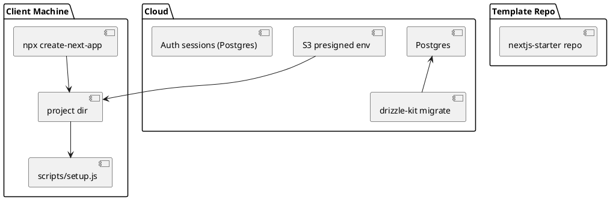

# SPEC-001 - Idempotent Next.js 15 Multi-site Starter

## Background

You need to produce 12+ production-ready Next.js 15 websites from a repeatable, idempotent, easy-to-follow starter. Each site must include:

* Next.js 15 + TypeScript
* PostgreSQL (Neon / Vercel Postgres or equivalent)
* Drizzle ORM + drizzle-kit migrations
* Tailwind CSS
* shadcn/ui (shadui)
* No JWTs — server-side sessions stored in Postgres via Auth.js (Auth.js + Drizzle adapter)
* Simple client bootstrap using `npx` (no pnpm by default)
* S3 presigned URLs to deliver environment files or starter assets to clients

The goal: fastest, most idempotent MVP path for producing repeatable sites with minimal client friction.

---

## Quick recommendation (one-line)

Maintain a single canonical GitHub template repo and bootstrap each site with `npx create-next-app@latest --example "https://github.com/<org>/nextjs-starter" <app-name> --use-npm`, then run the bundled `setup` script (which does `npm ci`, copies env from a presigned S3 link, runs Drift/Drizzle migrations and seeds). This is the fastest, most idempotent flow.

(Why?) `create-next-app --example` guarantees you always start from the latest Next.js scaffolding while using your canonical repo to carry opinionated wiring (Drizzle, Auth.js, shadcn, Tailwind). Using `npm`/`npx` keeps client friction low.

---

## Method — Idempotent flow (detailed)

### Project structure & repo

Keep a single GitHub template repository `nextjs-starter` that includes:

* `app/` Next.js app (TypeScript)
* `prisma/` or `drizzle/` schema files (we will use `drizzle/` for Drizzle schema + migrations)
* `drizzle.config.ts` and sample `drizzle` migrations directory
* `scripts/` containing a `setup.js` or `setup.ts` that is safe to run multiple times (idempotent)
* `scripts/migrate.ts` that runs drizzle-kit migration commands
* `scripts/seed.ts` deterministic seed (idempotent: `INSERT ... ON CONFLICT DO NOTHING`)
* `.env.example` with placeholders
* `package.json` with `postinstall`, `setup`, `migrate`, `seed`, `start:prod` scripts
* `README.md` with simple step-by-step client instructions and an S3 presigned URL workflow

Make the repo a GitHub Template or an `--example` suitable repo (subdirectory works).

### What the `setup` script does (idempotent)

1. `npm ci` (clean, reproducible install)
2. Copy `.env.example` to `.env.local` if `.env.local` doesn't exist. If you provide a presigned S3 `.env` link, the script downloads and writes it as `.env.local` — otherwise prompts for DB URL (CLI fallback).
3. Run `npx drizzle-kit generate` (no-op if no schema changes). Use `npx drizzle-kit generate:pg` if you prefer SQL generation strategy. (Docs: drizzle-kit generate / migrate.) citeturn0search3turn0search12
4. Run `npx drizzle-kit migrate` to apply migrations. This is safe to run repeatedly; migrations that already applied are skipped. citeturn0search4turn0search12
5. Run `node scripts/seed.js` (or `tsx scripts/seed.ts`) which performs idempotent upserts.
6. Output a final message with next steps (run `npm run dev`, deploy to Vercel, or push repo to remote).

### Recommended `package.json` scripts (cleaned)

Replace noisy tooling like Biome with standard eslint + prettier. Example `package.json` snippet (keep minimal):

```json
{
  "name": "nextjs-starter",
  "version": "0.1.0",
  "private": true,
  "scripts": {
    "dev": "next dev",
    "build": "next build",
    "start": "next start",
    "setup": "node ./scripts/setup.js",
    "migrate": "npx drizzle-kit migrate",
    "generate:migrations": "npx drizzle-kit generate",
    "seed": "node ./scripts/seed.js",
    "lint": "eslint . --ext .ts,.tsx",
    "format": "prettier --write ."
  },
  "dependencies": {
    "next": "15.x",
    "react": "19.x",
    "react-dom": "19.x",
    "drizzle-orm": "^0.x",
    "drizzle-kit": "^0.x",
    "@auth/core": "^0.x",
    "@auth/drizzle-adapter": "^0.x",
    "tailwindcss": "^4.x",
    "@shadcn/ui": "^x.x"
  },
  "devDependencies": {
    "eslint": "^8.x",
    "prettier": "^2.x",
    "typescript": "^5.x"
  }
}
```

(We will keep exact versions in the repo; pin major versions where compatibility matters.)

### Why remove Biome / pnpm from the default

* `biome` is replacing eslint/formatters for some teams, but it increases client friction if they dislike it (you said you don't want biome). Use `eslint` + `prettier` — simple and familiar. Keep `npm` as the primary package manager; `npx` works reliably on most systems and avoids pnpm’s additional learning curve. This reduces the chance the client runs into tooling blockers.

### Auth — Auth.js + Drizzle adapter (no JWTs)

* Use Auth.js with the official Drizzle adapter. It stores sessions server-side in Postgres and avoids JWTs. The adapter is designed to work with drizzle/schema and drizzle-kit migrations. (Docs: Auth.js Drizzle adapter.) 

### CLI options for speed (2 choices)

**A — Fastest, zero-publish approach (recommended):**

1. Developer creates `nextjs-starter` repo and marks it as a template (or keep it on the main branch). The repo contains the finished, minimal app.
2. Client runs:

```
npx create-next-app@latest my-site --use-npm --example "https://github.com/<org>/nextjs-starter"
cd my-site
npm run setup
```

This uses official `create-next-app` to pull the repo contents and keep the latest Next.js scaffolding behavior. `create-next-app` supports GitHub URLs for `--example`. citeturn0search1turn0search13

**B — One-command, published npx helper (optional):**

Publish a tiny scaffolder package `create-our-starter` to npm that, when invoked as `npx create-our-starter@latest my-site`, clones the template, runs `npm ci`, downloads `.env` from the S3 presigned link if provided, runs migrations and seeds. This is fancier but requires publishing and maintaining an npm package.

**Recommendation:** start with option A (no npm publishing), migrate to B only if you want a branded one-liner later.

### S3 presigned `.env` workflow (client-facing)

* You generate a `.env` with production-safe values (DB URL, NEXTAUTH_SECRET, etc.). Upload to S3 and create a presigned GET URL. Share the URL with the client.
* The client's `npm run setup` script accepts an env var `PRESIGNED_ENV_URL`. If set, `setup.js` downloads the file and writes `.env.local` without revealing secrets in chat.
* This keeps setup friction extremely low for the client and avoids manual copy/paste mistakes.

### Idempotency guarantees

* `npm ci` ensures dependency installs are reproducible if `package-lock.json` is committed.
* `setup.js` checks for `.env.local` and never overwrites it unless `--force` is passed.
* Migrations are applied with `npx drizzle-kit migrate` — already safe to run repeatedly. citeturn0search4turn0search12
* Seeds use UPSERT/ON CONFLICT or check-existence logic.

---

## PlantUML (high-level) — architecture



---

## Implementation checklist (MVP)

1. Create `nextjs-starter` repo with minimal working app and pinned dependencies. Include `drizzle.config.ts`, `drizzle` migrations folder, `scripts/setup.js`, `scripts/migrate.ts`, `scripts/seed.ts`, `.env.example`, `README.md`.
2. Add `package-lock.json` for reproducible installs.
3. Add `setup` script that supports `PRESIGNED_ENV_URL` and fallback interactive prompt.
4. Document `npx create-next-app@latest --example "https://github.com/<org>/nextjs-starter"` flow in `README.md` and provide a reusable checklist for clients.
5. Test the flow from an empty machine (delete `node_modules` and `.env.local`) and iterate until `setup` runs cleanly 3 times in a row.

---

## Client quick start (what you give the client)

1. `npx create-next-app@latest my-site --use-npm --example "https://github.com/<org>/nextjs-starter"`
2. `cd my-site`
3. `export PRESIGNED_ENV_URL="https://s3..."` (optional)
4. `npm run setup`
5. `npm run dev`

---

## Notes & references

* `create-next-app --example` supports GitHub URLs and is the fastest idempotent bootstrap. citeturn0search1turn0search13
* Drizzle migrations: use `npx drizzle-kit generate` and `npx drizzle-kit migrate`. These commands are designed to be safe to run repeatedly and are the recommended approach. citeturn0search3turn0search4
* Auth.js has a Drizzle adapter and is compatible with server-side session storage in Postgres (no JWTs). citeturn0search2turn0search18

---

## Next actions I can do now (pick one)

1. Add the full `scripts/setup.ts` and `scripts/seed.ts` implementations into this spec repo.
2. Produce the exact cleaned `package.json` and `.env.example` content and add to the repo.
3. Draft the client-facing `README.md` with screenshots and step-by-step commands.

Reply with the number you want me to produce next and I will add it to the template immediately (no waiting).
